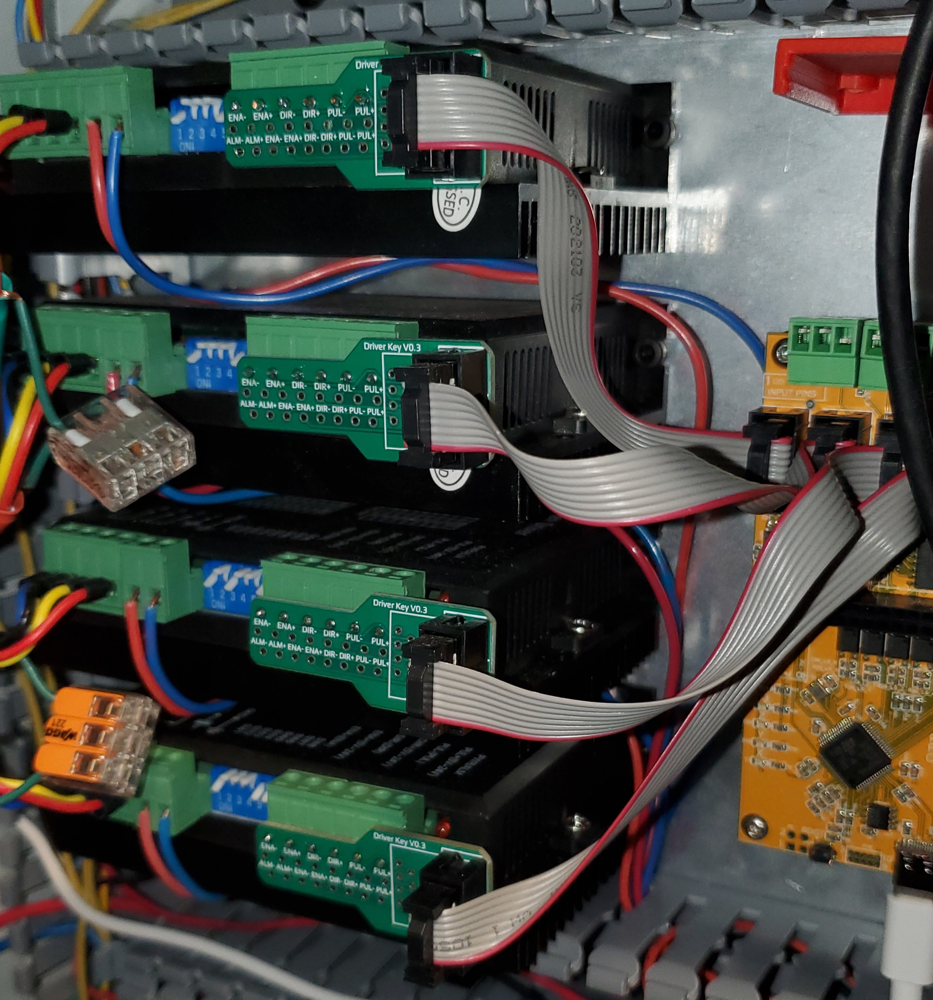
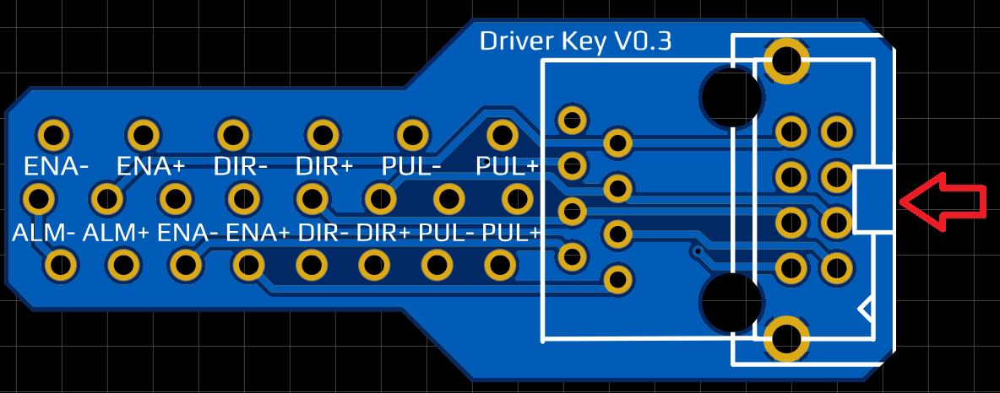
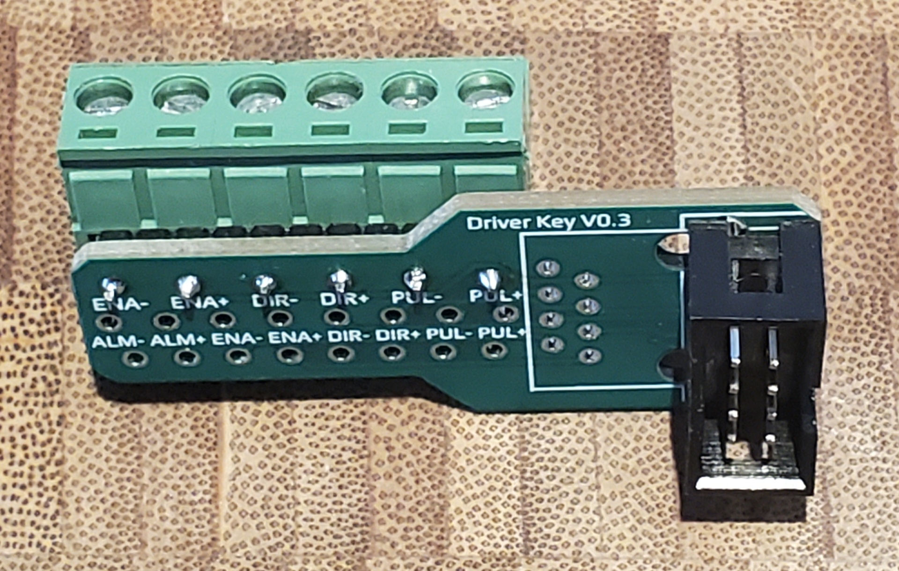
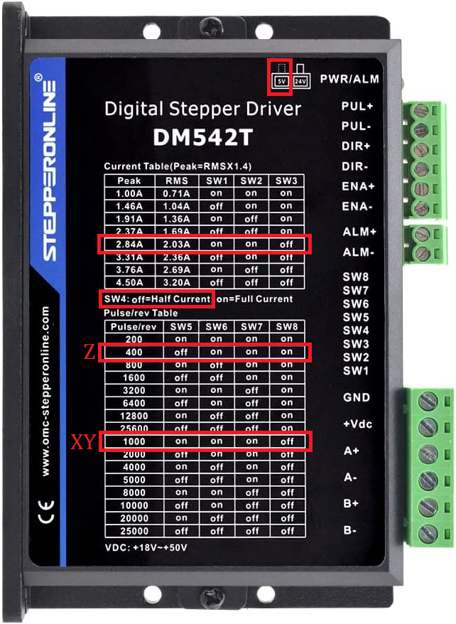

## Driver Key PCB for DM542T and DM556T

Goal: To provide a simple connection method from Flexihal or Grblhal 2000 IDC outputs to external drivers.

# Assembly: 

First solder the IDC 8 pin connector to the PCB, matching the silkscreen notch to the connector notch.  

Next remove the plugin screw terminal from the driver that has Enable, Direction and Pulse/Step inputs on it.  

Cut short pieces of 0.5mm^2/20AWG of bare(stripped) solid core wire 10mm or 3/8" long, insert into the Dir +/- and Step +/- screw terminal block and tighten the screws.

Next align the wires with the holes on the pcb that match the correct spacing, and solder in place.

Optional: Add wires for Enable and/or Error to the driver.  Currently neither is recommended for inital setup as it just adds confusion and doesn't provide a benefit with DM542T or DM556T drivers. 

Follow this guide to assemble the IDC cables, taking care to match the faint arrow with the red wire on both ends.  Use of a vice isn't required for 8pin idc, though, you can just press them together with a block of wood or metal on a countertop.  [IDC ribbon Cable Guide](https://startingelectronics.org/articles/IDC-ribbon-cable/)

Enjoy!  

As a bonus, here are the default jumpper settings for the PrintNC with 100 steps/mm for XYZ and 3A kit steppers on printed mounts.  

Logan BC CA - Logan#2225 on Three Design - PrintNC Discord
https://discord.gg/fXqRkUTsUD

If you like my work and want to buy me a beer (or coffee),  
you can use this [Paypal](https://www.paypal.com/donate/?hosted_button_id=QBMAY9ZB6N3F8) link    
or this QR code:  

