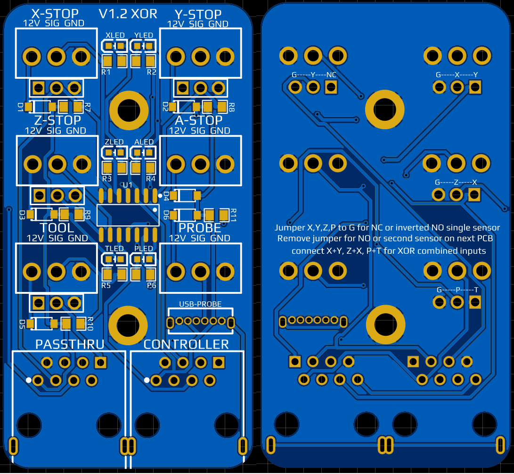

# Sensor XOR Endstop PCB

This is my universal design for the PrintNC or other CNC machine connection for sensor/switch endstops using a single ethernet cable for simplicity. It's directly compatible with the pinout for the Grblhal2000 EST and Flexihal controller boards, and by using a Cabinet Breakout PCB you can connect it to other controller designs.

This PCB has a supply voltage range of 12V to 18V due to the XOR IC.  While it's possible it'll work at higher voltages I cannot provide any warranty or guarantee of function. 

Main Benefits: 

Compact design, passthrough jack for series connection to second PCB if desired, XOR gate connection to either passthough PCB for X, Y, Z, and Probe, or jumpered connections between X+Y, X+Z, and Tool+Probe for input limited controllers; parallel breakout board based cncs for example. 

Default configuration: The jumpers below each of the X,Y,Z,and Probe screw terminals are connecting the passthough connection to ground to provide an active low signal so when combined with a NPN-NC input, an active low (monitored) output will result from the XOR IC gate.  

Jumper X,Y,Z,P to G for NC or inverted NO single sensor
Remove jumper for NO or second sensor on next PCB
Connect X+Y, Z+X, P+T for XOR combined inputs

Logan BC CA - Logan#2225 on [Three Design discord] (https://discord.gg/fXqRkUTsUD)

If you like my work and want to buy me a beer (or coffee),  
you can use this [Paypal](https://www.paypal.com/donate/?hosted_button_id=QBMAY9ZB6N3F8) link    
or this QR code:  

